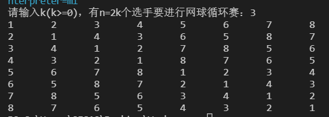

# 实践周-算法实践
> 学号：2020118100 &nbsp;&nbsp;姓名：庞晓宇


## 【第1题】输入n（n<=20），输出n个数的全排列。

### 【源码】
```c
#include <stdio.h>

int n, arr[50];
int canuse;

int arr_print(int cur) // 判断并输出数组（排列后的结果），返回判断结果
{
    int ok = cur >= n;
    if (ok)
    {
        for (int i = 1; i <= n; i++)
        {
            printf("%d", arr[i]);
            if (i != n)
                printf(" ");
        }
        printf("\n");
    }
    return ok;
}

void full_permutation(int cur)
{
    for (int i = 1; i <= n; i++) // i为当前处理的数字
    {
        canuse = 1;                   // 标记为1，表示当前数字可以使用
        for (int j = 1; j < cur; j++) // 从结果数组开头扫描到cur的前一位
        {
            if (arr[j] == i) // 当前处理的数字已被使用
            {
                canuse = 0; // 标记为0，表示当前数字不可以使用
                break;
            }
        }
        if (!canuse)                   // 当前数字不可以使用
            continue;                  // 继续扫描下一个数字
        arr[cur] = i;                  // 当前数字可以使用，放入结果数组cur位置
        if (!arr_print(cur))           // 如果没打印出来
            full_permutation(cur + 1); // 继续下一次递归调用
    }
}

int main(int argc, char const *argv[])
{
    scanf("%d", &n);     // 输入n
    full_permutation(1); // 开始递归
    return 0;
}
```

### 【代码运行截图】


---
## 【第2题】某公司年底给大家发金块作为奖金（共n块），最优秀的员工得到其中最重的一块，最不优秀的员工得到其中最轻的一块。假设有一台比较重量的仪器，请输出你用了多少次比较次数找出了最重和最轻的金块。（用递归和非递归分别实现）

### 【源码】
```c
#include <stdio.h>
#include <stdlib.h>
#include <time.h>

int countg = 0;

double *randomn(int n) // 生成n个随机数
{
    srand(time(NULL));
    double *arr = (double *)malloc(sizeof(double) * n);
    for (int i = 0; i < n; i++)
    {
        arr[i] = rand() % 10000 / 100.0;
    }
    return arr;
}

void arr_print(double *arr, int n)
{
    for (int i = 0; i < n; i++)
    {
        printf("%.2f ", arr[i]);
    }
    printf("\n");
}

int find_max_min_non_recursive(double *arr, int n, double *max, double *min)
{
    int count = 0;
    *max = *min = arr[0];
    for (int i = 1; ++count && i < n; i++)
    {
        if (++count && arr[i] > *max)
            *max = arr[i];
        else if (++count && arr[i] < *min)
            *min = arr[i];
    }
}

void find_max_min_recursive(double *arr, int left, int right, double *max, double *min)
{
    if (++countg && left == right)
    {
        if (++countg && arr[left] > *max)
            *max = arr[left];
        else if (++countg && arr[left] < *min)
            *min = arr[left];
        return;
    }
    int mid = (left + right) / 2;
    find_max_min_recursive(arr, left, mid, max, min);
    find_max_min_recursive(arr, mid + 1, right, max, min);
}

int main(int argc, char const *argv[])
{
    int n;
    printf("Please input the number of random numbers you want to generate: ");
    scanf("%d", &n);          // 输入n
    double *arr = randomn(n); // 生成随机数数组
    arr_print(arr, n);        // 打印数组

    // 非递归实现
    printf("non-recursive:\n");
    double max, min;
    int count = find_max_min_non_recursive(arr, n, &max, &min);
    printf("count: %d\n", count);
    printf("max: %.2f\n", max);
    printf("min: %.2f\n", min);

    // 递归实现
    printf("recursive:\n");
    double max1 = arr[0], min1 = arr[0];
    find_max_min_recursive(arr, 0, n - 1, &max1, &min1);
    printf("count: %d\n", countg);
    printf("max: %.2f\n", max1);
    printf("min: %.2f\n", min1);
    return 0;
}
```

### 【代码运行截图】


---
## 【第3题】已知由n（n≥2）个正整数构成的集合A={ak}（0≤k<n），将其划分为两个不相交的子集A1和A2，元素个数分别是n1和n2，A1和A2中元素之和分别为S1和S2。设计一个尽可能高效的划分算法，满足|n1-n2|最小且|S1-S2|最大。

### 【源码】
```c
#include <stdio.h>
#include <stdlib.h>
#include <time.h>

int *randomn(int n) // 生成n个随机数
{
    srand(time(NULL));
    int *arr = (int *)malloc(sizeof(int) * n);
    for (int i = 0; i < n; i++)
    {
        arr[i] = rand() % 1000;
    }
    return arr;
}

void arr_print(int *arr, int n)
{
    for (int i = 0; i < n; i++)
    {
        printf("%d ", arr[i]);
    }
    printf("\n");
}

void arr_print_2(int *arr, int pivot, int n)
{
    printf("第一部分：");
    for (int i = 0; i < pivot; i++)
    {
        printf("%d ", arr[i]);
    }
    printf("\n");

    printf("第二部分：");
    for (int i = pivot; i < n; i++)
    {
        printf("%d ", arr[i]);
    }
    printf("\n");
}

int subpartition(int *arr, int left, int right)
{
    int pivot = arr[left];
    while (left < right)
    {
        while (left < right && arr[right] >= pivot)
        {
            right--;
        }
        arr[left] = arr[right];
        while (left < right && arr[left] <= pivot)
        {
            left++;
        }
        arr[right] = arr[left];
    }
    arr[left] = pivot;
    return left;
}

int partition(int *arr, int n)
{
    int left = 0;
    int right = n - 1;
    int pivot = subpartition(arr, left, right);
    while (pivot != n / 2)
    {
        if (pivot < n / 2)
        {
            pivot = subpartition(arr, pivot + 1, right);
        }
        else
        {
            pivot = subpartition(arr, left, pivot - 1);
        }
    }
    return pivot;
}

int main(int argc, char const *argv[])
{
    int n = 0;
    printf("请输入数组长度：");
    scanf("%d", &n);

    int *arr = randomn(n);
    printf("原始数组：");
    arr_print(arr, n);

    int pivot = partition(arr, n);
    printf("pivot: %d\n", pivot);
    arr_print_2(arr, pivot, n);
    return 0;
}
```

### 【代码运行截图】


---
## 【第4题】设有n=2k个选手要进行网球循环赛，要求设计一个满足以下要求的比赛日程表：
1. 每个选手必须与其他n-1个选手各赛一次。
2. 每个选手一天只能赛一次。
3. 循环赛在n-1天之内结束。

### 【源码】
```c
#include <stdio.h>
#include <stdlib.h>
#include <math.h>
/**
 * 设有n=2k个选手要进行网球循环赛，要求设计一个满足以下要求的比赛日程表：
 * 1. 每个选手必须与其他n-1个选手各赛一次。
 * 2. 每个选手一天只能赛一次。
 * 3. 循环赛在n-1天之内结束。
 */

int **new_schedule(int n)
{
    int **schedule = (int **)malloc(sizeof(int *) * (n + 1));
    for (int i = 0; i <= n; i++)
    {
        schedule[i] = (int *)malloc(sizeof(int) * (n + 1));
    }
    return schedule;
}

// 进行循环赛日程安排，生成日程表
void create_schedule(int k, int n, int **schedule)
{
    // 设置日程表第一行的值
    for (int i = 1; i <= n; i++)
        schedule[1][i] = i;

    // 每次填充的起始填充位置
    int begin = 1;

    // 用分治法分separate份，循环求解
    for (int separate = 1; separate <= k; separate++)
    {
        n /= 2; // 日程表进行划分
        // flag为每一小份的列的标记
        for (int flag = 1; flag <= n; flag++)
        {
            for (int i = begin + 1; i <= 2 * begin; i++) // 操作行
            {
                for (int j = begin + 1; j <= 2 * begin; j++) // 操作列
                {
                    // 把左上角的值赋给右下角
                    schedule[i][j + (flag - 1) * begin * 2] = schedule[i - begin][j + (flag - 1) * begin * 2 - begin];
                    // 把右上角的值赋给左下角
                    schedule[i][j + (flag - 1) * begin * 2 - begin] = schedule[i - begin][j + (flag - 1) * begin * 2];
                }
            }
        }
        // 进入日程表的下一个划分进行填充
        begin *= 2;
    }
}

// 打印日程表
void show_schedule(int **schedule, int n)
{
    for (int i = 1; i <= n; i++)
    {
        for (int j = 1; j <= n; j++)
        {
            printf("%d\t", schedule[i][j]);
        }
        printf("\n");
    }
}

int main()
{
    int n = 0, k = 0;

    printf("请输入k(k>=0)，有n=2k个选手要进行网球循环赛：");
    scanf("%d", &k); // 输入k

    n = pow(2, k); // 选手数

    // 分配日程表空间
    int **schedule = new_schedule(n);

    // 进行循环赛日程安排，生成日程表
    create_schedule(k, n, schedule);

    // 显示输出
    show_schedule(schedule, n);

    return 0;
}
```

### 【代码运行截图】




---
## 【第5题】利用分治法，求解一个整数序列的最大连续子序列和。

### 【源码】
```c
#include <stdio.h>
#include <stdlib.h>
#include <time.h>

int *randomn(int n) // 生成n个随机数
{
    srand(time(NULL));
    int *arr = (int *)malloc(sizeof(int) * n);
    for (int i = 0; i < n; i++)
    {
        arr[i] = rand() % 1000 - 500;
    }
    return arr;
}

void arr_print(int *arr, int n)
{
    for (int i = 0; i < n; i++)
    {
        printf("%d ", arr[i]);
    }
    printf("\n");
}

long max3(long a, long b, long c)
{
    long max = a;
    if (b > max)
        max = b;
    if (c > max)
        max = c;
    return max;
}

// 求a[left..high]序列中最大连续子序列和
long maxSubSum(int a[], int left, int right)
{
    int i, j;
    long maxLeftSum, maxRightSum;
    long maxLeftBorderSum, leftBorderSum;
    long maxRightBorderSum, rightBorderSum;
    if (left == right) // 子序列只有一个元素时
    {
        if (a[left] > 0) // 该元素大于0时返回它
            return a[left];
        else // 该元素小于或等于0时返回0
            return 0;
    }
    int mid = (left + right) / 2;               // 求中间位置
    maxLeftSum = maxSubSum(a, left, mid);       // 求左边
    maxRightSum = maxSubSum(a, mid + 1, right); // 求右边
    maxLeftBorderSum = 0, leftBorderSum = 0;
    for (i = mid; i >= left; i--) // 求出以左边加上a[mid]元素
    {
        leftBorderSum += a[i]; // 构成的序列的最大和
        if (leftBorderSum > maxLeftBorderSum)
            maxLeftBorderSum = leftBorderSum;
    }
    maxRightBorderSum = 0, rightBorderSum = 0;
    for (j = mid + 1; j <= right; j++) // 求出a[mid]右边元素
    {
        rightBorderSum += a[j]; // 构成的序列的最大和
        if (rightBorderSum > maxRightBorderSum)
            maxRightBorderSum = rightBorderSum;
    }
    return max3(maxLeftSum, maxRightSum, maxLeftBorderSum + maxRightBorderSum);
}

int main(int argc, char const *argv[])
{
    int n = 10;
    printf("请输入数组长度：");
    scanf("%d", &n);
    int *arr = randomn(n);

    printf("原始数组：");
    arr_print(arr, n);

    printf("最大连续子序列和为：%ld\n", maxSubSum(arr, 0, n - 1));
    return 0;
}
```

### 【代码运行截图】


---
## 【第6题】有一个2k×2k（k>0）的棋盘，恰好有一个方格与其他方格不同，称之为特殊方格(特殊方格不能被骨牌覆盖)。现在要用如下的L型骨牌覆盖除了特殊方格外的其他全部方格，骨牌可以任意旋转，并且任何两个骨牌不能重叠。请给出一种覆盖方法。

### 【源码】
```c
#include <stdio.h>
#include <math.h>
#define MAX 1025

// // 问题表示
// int k;    // 棋盘大小
// int x, y; // 特殊方格的位置

// 求解问题表示
int board[MAX][MAX];
int tile = 1; // 骨牌编号

void ChessBoard(int tr, int tc, int dr, int dc, int size)
{
    if (size == 1)
        return;            // 递归出口
    int chess_no = tile++; // 取一个L型骨，其牌号为tile
    int s = size / 2;      // 分割棋盘

    // 考虑左上角象限
    if (dr < tr + s && dc < tc + s) // 特殊方格在此象限中
        ChessBoard(tr, tc, dr, dc, s);
    else // 此象限中无特殊方格
    {
        board[tr + s - 1][tc + s - 1] = chess_no;      // 用chess_no号L型骨牌覆盖右下角
        ChessBoard(tr, tc, tr + s - 1, tc + s - 1, s); // 将右下角作为特殊方格继续处理该象限
    }

    // 考虑右上角象限
    if (dr < tr + s && dc >= tc + s)
        ChessBoard(tr, tc + s, dr, dc, s); // 特殊方格在此象限中
    else                                   // 此象限中无特殊方格
    {
        board[tr + s - 1][tc + s] = chess_no;          // 用chess_no号L型骨牌覆盖左下角
        ChessBoard(tr, tc + s, tr + s - 1, tc + s, s); // 将左下角作为特殊方格继续处理该象限
    }

    // 处理左下角象限
    if (dr >= tr + s && dc < tc + s) // 特殊方格在此象限中
        ChessBoard(tr + s, tc, dr, dc, s);
    else // 此象限中无特殊方格
    {
        board[tr + s][tc + s - 1] = chess_no;          // 用chess_no号L型骨牌覆盖右上角
        ChessBoard(tr + s, tc, tr + s, tc + s - 1, s); // 将右上角作为特殊方格继续处理该象限
    }

    // 处理右下角象限
    if (dr >= tr + s && dc >= tc + s) // 特殊方格在此象限中
        ChessBoard(tr + s, tc + s, dr, dc, s);
    else // 此象限中无特殊方格
    {
        board[tr + s][tc + s] = chess_no;              // 用chess_no号L型骨牌覆盖左上角
        ChessBoard(tr + s, tc + s, tr + s, tc + s, s); // 将左上角作为特殊方格继续处理该象限
    }
}

void showBoard(int size)
{
    int i, j;
    for (i = 0; i < size; i++)
    {
        for (j = 0; j < size; j++)
            printf("%4d", board[i][j]);
        printf("\n");
    }
}

int main(int argc, char const *argv[])
{
    int k = 0;
    printf("请输入棋盘大小k (2^k * 2^ k)：");
    scanf("%d", &k);

    int x = 0, y = 0;
    printf("请输入特殊方格的位置 x y：");
    scanf("%d %d", &x, &y);

    ChessBoard(0, 0, x, y, (int)pow(2, k));

    showBoard((int)pow(2, k));

    return 0;
}
```

### 【代码运行截图】


---
## 【第7题】对于一个长度为n的有序序列（假设均为升序序列）a[0..n-1]，处于中间位置的元素称为a的中位数。设计一个算法求给定的两个有序序列的中位数。例如，若序列a=(11，13，15，17，19)，其中位数是15，若b=(2，4，6，8，20)，其中位数为6。两个等长有序序列的中位数是含它们所有元素的有序序列的中位数，例如a、b两个有序序列的中位数为11。


### 【源码】
```c
#include <stdio.h>
#include <stdlib.h>
#include <time.h>

int *randomn(int n) // 生成n个随机数
{
    int *arr = (int *)malloc(sizeof(int) * n);
    for (int i = 0; i < n; i++)
    {
        arr[i] = rand() % 1000;
    }

    // 对arr进行简单选择排序，使之有序
    for (int i = 0; i < n - 1; i++)
    {
        int min = i;
        for (int j = i + 1; j < n; j++)
        {
            if (arr[j] < arr[min])
                min = j;
        }
        int temp = arr[i];
        arr[i] = arr[min];
        arr[min] = temp;
    }
    return arr;
}

void arr_print(int *arr, int n)
{
    for (int i = 0; i < n; i++)
    {
        printf("%d ", arr[i]);
    }
    printf("\n");
}

double find_the_median_number(int *arr1, int m, int *arr2, int n)
{
    int i = 0, j = 0, k = (m + n) / 2, l = 0;
    int *arr = (int *)malloc(sizeof(int) * (k + 1));
    while (l <= k && i < m && j < n)
    {
        if (arr1[i] < arr2[j])
        {
            arr[l++] = arr1[i++];
        }
        else
        {
            arr[l++] = arr2[j++];
        }
    }
    while (l <= k && i < m)
    {
        arr[l++] = arr1[i++];
    }
    while (l <= k && j < n)
    {
        arr[l++] = arr2[j++];
    }
    return (m + n) % 2 == 0 ? (arr[k] + arr[k - 1]) / 2.0 : arr[k];
}

int main(int argc, char const *argv[])
{
    srand(time(NULL));

    int m, n;
    printf("Please input the number of random numbers you want to generate: ");
    scanf("%d %d", &m, &n); // 输入m, n

    int *arr1 = randomn(m); // 生成随机数数组
    int *arr2 = randomn(n); // 生成随机数数组

    printf("The first array is: ");
    arr_print(arr1, m);
    printf("The second array is: ");
    arr_print(arr2, n);

    double num = find_the_median_number(arr1, m, arr2, n);
    printf("The median number is: %.2f\n", num);

    return 0;
}
```

### 【代码运行截图】


